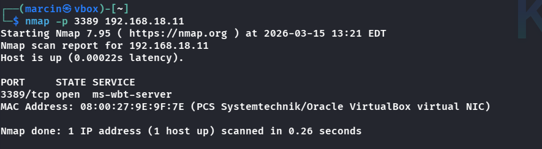
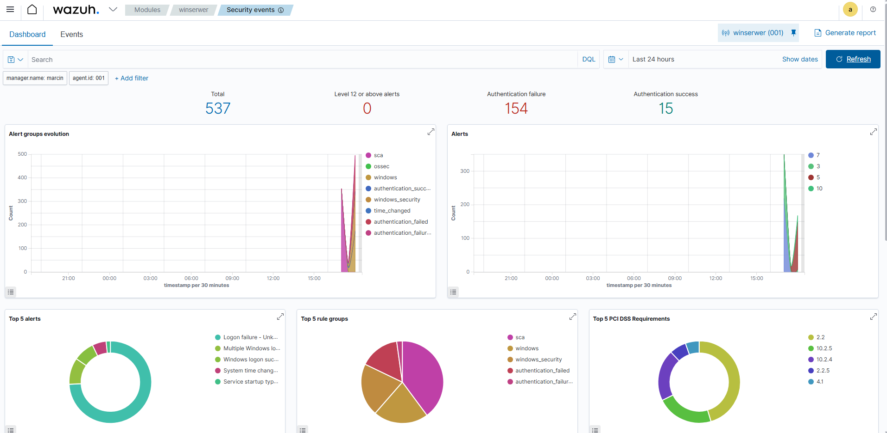
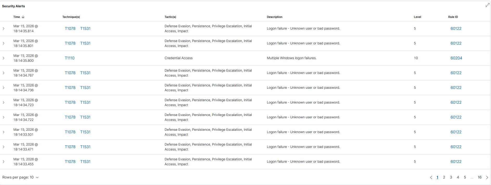

# RDP Brute Force Detection and Mitigation using Wazuh SIEM

## Overview

This project demonstrates a full SOC workflow using a lab environment:

1. Simulation of a brute force attack on RDP from Kali Linux  
2. Windows Server logging failed login attempts via Sysmon and Windows Event Logs  
3. Wazuh Agent collects and forwards logs to Wazuh Manager  
4. Wazuh Dashboard generates alerts for security monitoring  

This scenario is designed as a **Blue Team / SOC portfolio project**.

---

## Lab Environment

| Component | Description | IP |
|-----------|-------------|----|
| Attacker | Kali Linux | 192.168.18.14 |
| Target | Windows Server with RDP and Sysmon | 192.168.18.11 |
| SIEM | Wazuh Manager + Agent | 192.168.18.10 |

Network setup: VirtualBox host-only adapters ensure all machines can communicate internally.  

---

## Tools Used

- **Hydra** – brute force tool   
- **Wazuh Agent** – collects and forwards logs to the manager  
- **Wazuh Dashboard** – visualizes alerts and security events  
- **Nmap** – optional, used to confirm open ports  

---

## Attack Simulation Steps

1. Confirm RDP port is open

2. Brute force attack

3. Dashboard Wazuh

4. Windows Server logs

